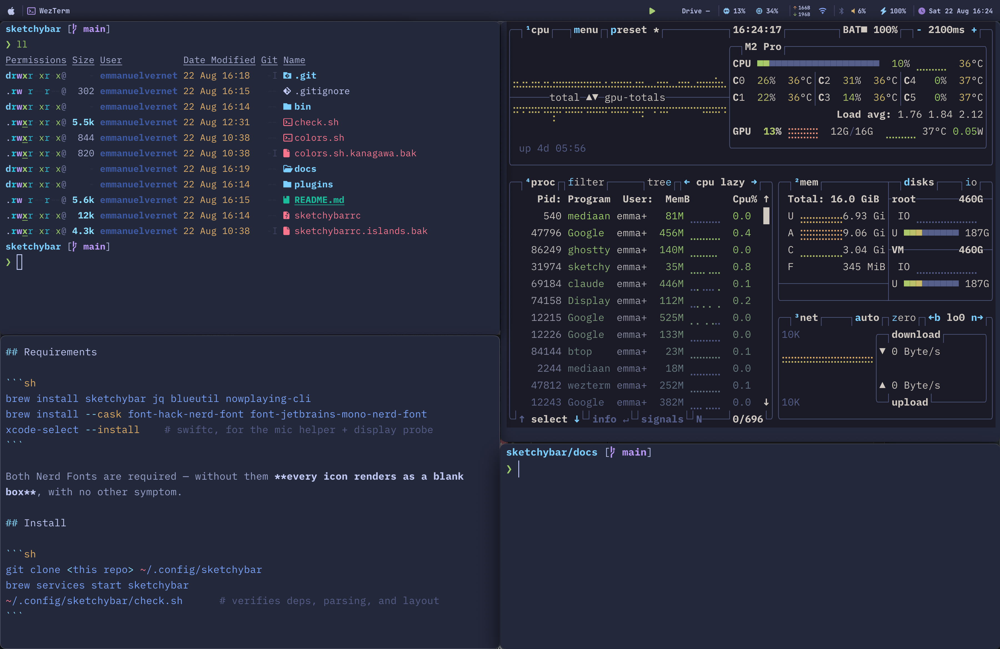
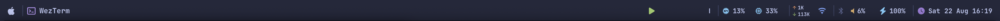
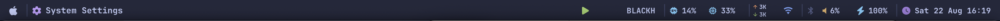

# sketchybar — Tokyo Night Storm

A plain (non-floating, no pills) SketchyBar config in the Tokyo Night Storm
palette, sized to sit exactly in the macOS reserved menu bar area.



The bar re-fits itself to the display, so the same config works at any
resolution — the reserved top inset it must match is 38pt here and 32pt at the
default (see [Notes](#notes--gotchas)):



*Scaled resolution, 1800×1169 — 38pt inset.*



*Default resolution, 1512×982 — 32pt inset, re-fitted on `display_change`.*

## Requirements

```sh
brew install sketchybar jq blueutil nowplaying-cli
brew install --cask font-hack-nerd-font font-jetbrains-mono-nerd-font
xcode-select --install    # swiftc + clang, for bin/sb-helper and the probes
```

Both Nerd Fonts are required — without them **every icon renders as a blank
box**, with no other symptom.

## Install

```sh
git clone <this repo> ~/.config/sketchybar
brew services start sketchybar
~/.config/sketchybar/check.sh      # verifies deps, parsing, and layout
```

`bin/build.sh` compiles the Swift helpers at startup if they are missing or
stale, so there is no build step. Only the sources are tracked.

## bin/sb-helper

Most items are shell plugins, which is the model SketchyBar hands you: it forks
a script per item per tick. The fork is the cost — `bash` alone is ~11ms, each
`jq` ~13ms, and every `sketchybar --set` is a ~4.9ms CLI round trip that packs
argv, re-looks-up the mach port and waits for a reply. Six items were burning
**~4.2s of process time per minute** between them.

`bin/sb-helper` is one long-lived process that renders those six instead, over
SketchyBar's own mach port at **~0.004ms per update** — a cached port, no argv
packing, no reply awaited. It also replaces their data sources with frameworks:

| Item | Was | Now |
|---|---|---|
| `cpu` | `ps -A` summed in awk | `host_statistics64` tick deltas |
| `mem` | `memory_pressure` | unchanged, deliberately (see below) |
| `net_up` / `net_down` | `netstat -ibn` | `getifaddrs` + `SCDynamicStore` |
| `mic` | `bin/mic-active` every 3s | CoreAudio listener — **push, not poll** |
| `volume` | 3 × `osascript` (~107ms each) | CoreAudio, and events over mach |
| `herdr` + digits | `bash` + `jq` per tick | one `herdr agent list`, parsed natively |

Two details worth knowing:

- **`mem` still shells out to `memory_pressure`.** Every native page sum
  disagrees with it wildly — 20% used versus 56% on this machine — so going
  native would have silently redefined the item *and* invalidated the 60%/85%
  colour thresholds. `--selftest` reports both numbers (`mem`, `mem_resident`)
  so switching later is a threshold change, not an investigation.
- **`volume` receives its events over mach.** An item with
  `mach_helper=<bootstrap name>` has its events delivered to that port instead
  of forking. The helper claims the name and then sets the property on itself,
  so the ordering can never be wrong. This is what makes a scroll instant.

`sb-shim.c` exists for one reason: `bootstrap_register` — the call that claims
the name — is not merely deprecated but *unavailable* to Swift, a hard compile
error. `bootstrap_look_up` is missing from Swift's `Darwin` module too, so
`sb-shim.h` doubles as the bridging header.

If the helper is missing or fails to compile, `sketchybarrc` restores the shell
plugins' timers, so the bar degrades to the old behaviour rather than showing
`--` forever. `check.sh` asserts whichever of the two is in force.

Debugging: `SB_HELPER_DEBUG=1 bin/sb-helper git.felix.test` traces the receive
path, and `bin/sb-helper --selftest` prints every reading as `key=value`.

## Permissions

| Grant | Needed for | Without it |
|---|---|---|
| **Microphone** (your terminal, once) | — | Nothing; the mic *indicator* needs no grant |
| **Accessibility** → sketchybar | `Lock` and `Force Quit` in the  menu | Those two rows silently do nothing; the other eight work |
| **Screen Recording** → sketchybar | Nothing currently | Only needed if you add `alias` items to mirror menu bar extras |

Add the CLI binary itself, not a `.app`: `$(brew --prefix)/bin/sketchybar`.
Restart with `brew services restart sketchybar` after granting.

## Layout

**Left** —  power menu · focused app · herdr flock (agent count per state:
red blocked / blue working / green done / dim idle; click for the card, a row
click focuses that agent) · current meeting · productive timer
**Right** — now playing · CPU / memory · network (stacked ↑/↓) + Wi-Fi ·
Bluetooth / volume / battery · mic-in-use · clock

Interactive: click volume to mute (scroll to change), Bluetooth to toggle power,
now-playing to play/pause, CPU/memory for Activity Monitor, clock for the ISO
week + this week's hours + jump-offs to the calendar, timesheet and Focus note,
Wi-Fi and battery for their Settings panes, mic for the privacy pane.

The mic indicator is hidden unless something is actually capturing, and the
now-playing item hides itself when nothing is playing.

## Customising

`sketchybarrc` opens with a **fonts and measured widths** block. The width
constants are not arbitrary — they are measured so labels never clip and never
shift the bar as digit counts change. If you change a font size, re-measure:

```sh
sketchybar --set volume label.width=-1 label="100%"   # auto-size
sketchybar --query volume | jq '.bounding_rects'      # read the width
```

`check.sh` asserts no clipping and no drift, so a bad constant fails loudly.

Colours live in `colors.sh` and are read by every plugin; swapping that one file
changes the whole theme.

## Notes / gotchas

Things that are not obvious and cost real time to work out:

- **Bar height and the notch are queried, not hardcoded.**
  `bin/screen-metrics.swift` reports the reserved top inset and notch bounds.
  The bar height must equal that inset or the bar either leaves a strip of
  desktop below it or overhangs the windows underneath.
- **The reserved inset changes with resolution,** not just with hardware: 38pt
  at 1800x1169 but 32pt at the default 1512x982 on the same MacBook. The startup
  probe runs only at config load, so `plugins/display.sh` re-fits the height on
  the `display_change` event. Point-based widths are unaffected by scaling.
- **Notch clearance shrinks as the resolution drops.** At 1800pt wide the right
  cluster clears the notch by ~150pt; at 1512pt only ~26pt. `check.sh` verifies
  it per display, so trim an item if it ever fails.
- **`notch_width` does not reflow left/right items.** It only affects
  *centre*-positioned ones. Keeping items clear of the notch is a matter of
  bounding cluster widths — `check.sh` verifies it per display.
- **Text scrolling needs `max_chars`, not `label.width`.** SketchyBar only
  animates strings it truncated itself. `label.width` clips without scrolling.
- **`label.width` includes `label.padding_left` but excludes
  `padding_right`;** `icon.width` includes `icon.padding_left`. A too-small
  `icon.width` silently eats the icon→label gap.
- **Positive `y_offset` moves content up.** Undocumented; verified on screen.
- **Only negative `padding_right` shifts an item** in a right-anchored cluster.
  That is how the two throughput rows stack into one column.
- **`networksetup -getairportnetwork` is broken on macOS 15** — it reports "not
  associated" while connected. `wifi.sh` reads `ipconfig getsummary` instead.
- **No shell path to mic-in-use on Apple Silicon.** There is no
  `IOAudioEngineState` in `ioreg`; `bin/mic-active.swift` reads
  `kAudioDevicePropertyDeviceIsRunningSomewhere`, the property behind the orange
  dot.
- **`CGSession` was removed in macOS 15,** so `Lock` uses the Ctrl+Cmd+Q
  keystroke. If your screen-lock delay is not immediate, screensaver-based
  "locks" only blank the display.
- **`U+F8FF` (the  literal) is absent from Hack Nerd Font.** The Apple glyph is
  `U+F179`. Glyphs prone to being dropped by editors are written as octal
  escapes and asserted byte-wise in `check.sh`.
- **Popups only ever draw on the main display.** Click a bar item on an
  external screen and its card appears on the laptop. This is not
  configurable: `associated_display` on the popup rows only hides them (on
  both screens), and hovering, real clicks and CLI triggers on the second
  display all render at the main display's coordinates. Verified by
  screenshotting both screens with a card open — the bar draws on both, the
  card only on the main one. Accepted as-is; the cards are a laptop-screen
  feature. It does follow the main display, so in clamshell the cards appear
  on whichever external screen macOS has made primary.
- **An external screen reserves no top inset,** because macOS gives the menu
  bar to one display and, with `com.apple.spaces spans-displays = 1`
  ("Displays have separate Spaces" off), that is the built-in one. On the
  MacBook it is the *notch* reserving the 32pt, not the menu bar, which
  auto-hides. So a maximised window on an external screen takes its full
  height and would cover the bar — hence `topmost=on`. The bar then draws
  above windows there, but windows still extend underneath it rather than
  being kept clear.
- **SketchyBar windows sit at layer −20,** so `screencapture` cannot see the
  bar — neither by region nor full screen. Verify rendering by eye.
- **`alias` items are display-only.** They mirror the image; clicks are not
  forwarded, so they do not restore reachability of hidden menu bar extras.

## Credits

Palette: [Tokyo Night](https://github.com/folke/tokyonight.nvim) (Storm).
Bar: [SketchyBar](https://github.com/FelixKratz/SketchyBar) by Felix Kratz.
